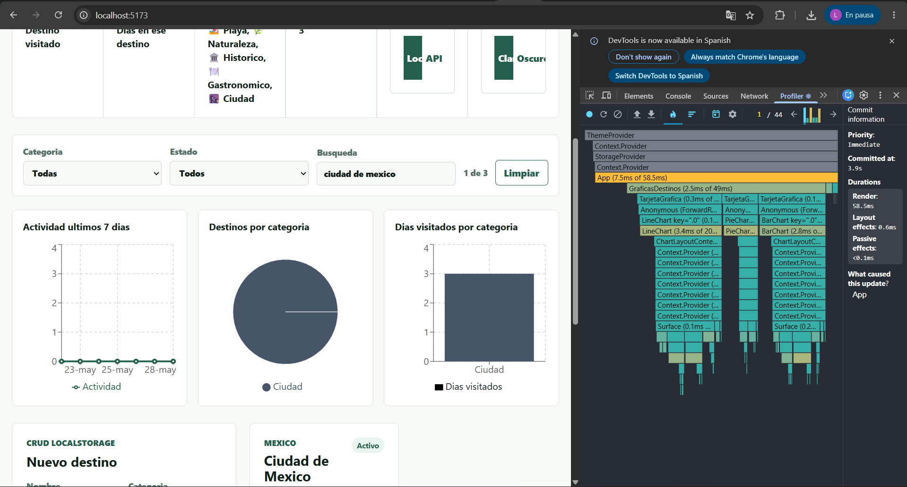
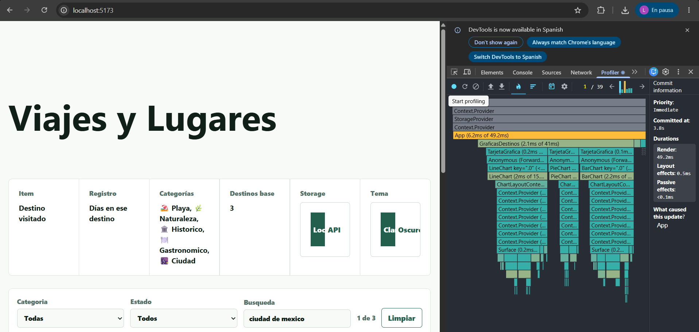
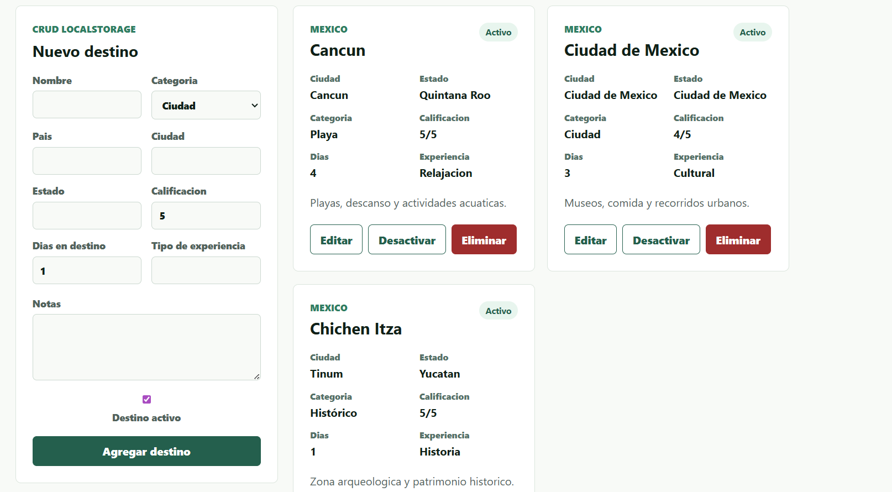

## Luis Alejandro Hernández Márquez (241424)
## Sistemas y tecnologías web - Proyecto 2
## Prof. Ludwing Cano

# Viajes y Lugares - Fase 1, 2 y 3

Proyecto universitario con frontend en React + Vite y backend en Express.

## Tema

Log de destinos visitados. La aplicacion permite registrar lugares de viaje con pais, ciudad, estado, categoria, calificacion, dias visitados, notas y estado activo.

## Estructura

```text
proyecto2_web/
  frontend/
    src/
      components/
      services/
      utils/
  backend/
    src/
      config/
      db/
      repositories/
      routes/
      utils/
```

## Frontend

- React con Vite.
- JavaScript puro.
- useState con lazy initializer.
- useEffect para sincronizar LocalStorage.
- useContext para StorageContext y ThemeContext.
- useRef para focus del formulario y scroll automatico al ultimo destino agregado.
- CRUD completo usando LocalStorage o API segun el modo activo.
- Tema claro/oscuro persistido en LocalStorage.
- Atajos: Ctrl + N enfoca el nombre y T alterna el tema visual.
- Componentes obligatorios:
  - FormularioItem.jsx
  - ListaItems.jsx
  - ItemCard.jsx
- Fase 3:
  - useReducer para manejar destinos, filtros y actividad.
  - Filtros combinados por categoria, estado y busqueda.
  - 3 graficas con Recharts.
  - useMemo para lista filtrada y datos de graficas.
  - useCallback y React.memo para optimizar tarjetas.

Comandos:

```bash
cd frontend
npm install
npm run dev
npm run build
npm run lint
```

## Fase 3 - Reducer

El estado principal de destinos se migro a `useReducer` en
`frontend/src/reducers/destinosReducer.js`. El reducer es puro.

Acciones implementadas:

```text
CARGAR_DESTINOS
AGREGAR_DESTINO
ACTUALIZAR_DESTINO
ARCHIVAR_DESTINO
CAMBIAR_ESTADO_DESTINO
ACTUALIZAR_FILTROS
LIMPIAR_FILTROS
REGISTRAR_ACTIVIDAD_DESTINO
```

## Fase 3 - Graficas

Las graficas estan en `frontend/src/components/GraficasDestinos.jsx` y se
actualizan con los filtros activos. Todas tienen `Tooltip` y `Legend`.

```text
1. Actividad ultimos 7 dias: muestra acciones registradas sobre destinos.
2. Destinos por categoria: muestra la distribucion por tipo de viaje.
3. Dias visitados por categoria: muestra el tiempo invertido por categoria.
```

## Mi grafica original

Mi grafica original es "Dias visitados por categoria". La elegi porque en un
log de viajes no solo importa cuantos destinos se registran, sino cuanto tiempo
se dedica a cada tipo de experiencia: playa, naturaleza, historico,
gastronomico o ciudad.

## Optimizacion

La lista visible usa `useMemo` para recalcularse solo cuando cambia la lista de
destinos o alguno de los filtros: categoria, estado o busqueda. Los datos de
las graficas tambien usan `useMemo`, porque transforman los destinos filtrados
en series para Recharts.

Los handlers que llegan a `ItemCard` se mantienen con `useCallback`, y
`ItemCard` se exporta con `React.memo`. Con esto, una tarjeta puede evitar
renderizarse cuando sus props no cambian.

## Evidencia React DevTools Profiler

Capturas de Profiler incluidas para la entrega:

### Antes de useMemo



### Despues de useMemo



Antes de aplicar la optimizacion, escribir en el buscador provocaba
que la lista se filtrara y que las tarjetas recibieran funciones nuevas en cada
render. Despues de usar `useMemo`, `useCallback` y `React.memo`, los calculos
derivados se recalculan solo cuando cambian sus dependencias reales, y las
tarjetas que conservan las mismas props pueden dejar de re-renderizarse.

## Mis 3 decisiones tecnicas

1. Estructura del reducer: use nombres de acciones relacionados con viajes y
   destinos para que el codigo no quedara como una plantilla generica.
2. Accion mas dificil: `CAMBIAR_ESTADO_DESTINO`, porque primero se persiste el
   cambio en LocalStorage o API y despues se actualiza el reducer con el destino
   confirmado.
3. Grafica mas compleja: actividad ultimos 7 dias, porque convierte el registro
   de actividad en una serie temporal y ademas respeta los filtros activos.

## Backend

- Express.
- SQLite.
- CORS usando FRONTEND_URL desde .env.
- Tablas:
  - items
  - registros

Endpoints:

```text
GET    /api/items
POST   /api/items
PUT    /api/items/:id
DELETE /api/items/:id
POST   /api/items/:id/registro
```

Comandos:

```bash
cd backend
npm install
npm start
```

## Nota importante

En fase 2 el frontend puede trabajar en modo LocalStorage o modo API desde el selector de la interfaz.

## Categorias personalizadas

Las categorias del tema de viajes tienen emoji y color propio:

```text
Playa         #0EA5E9
Naturaleza    #16A34A
Historico     #A855F7
Gastronomico  #F97316
Ciudad        #475569
```

## Mi paleta de colores

### Tema claro

`#f8faf7` Fondo principal.
Este tono verde casi blanco mantiene la aplicacion luminosa sin verse plana. Tambien ayuda a que las tarjetas blancas se separen con suavidad.

`#ffffff` Superficie.
Se usa en formularios, resumen y tarjetas para priorizar lectura. Contrasta con el fondo sin meter ruido visual.

`#182126` Texto base.
Es un tono oscuro con matiz verde, mas amable que negro puro. Mantiene buena legibilidad en textos largos y labels.

`#102018` Titulos.
Da mas peso a nombres de destinos y encabezados. Refuerza jerarquia sin depender solo del tamano de letra.

`#557168` Texto secundario.
Sirve para metadatos como pais, etiquetas y descripciones. Baja la intensidad para que el contenido principal respire.

`#245f4d` Acento.
Conecta con la idea de viajes, naturaleza y rutas. Se usa en botones y controles activos para indicar accion principal.

### Tema oscuro

`#121212` Fondo principal.
Reduce fatiga visual en sesiones largas y mantiene una base neutra. Evita que la interfaz se vea demasiado azul o saturada.

`#1d2421` Superficie.
Separa tarjetas y formularios del fondo oscuro. Conserva profundidad sin usar sombras pesadas.

`#f0f0f0` Texto base.
Ofrece lectura clara sobre fondos oscuros. No es blanco puro, asi que evita brillo excesivo.

`#ffffff` Titulos.
Reserva el contraste maximo para nombres y encabezados. Ayuda a escanear rapidamente cada destino.

`#a7b9b1` Texto secundario.
Mantiene labels y detalles visibles sin competir con el contenido. Su matiz verde conserva continuidad con el tema claro.

`#74d3ad` Acento.
Da energia a botones y switches en modo oscuro. Su luminosidad funciona bien sobre superficies profundas.


# Captura prueba fase 1
## Captura prueba fase 1


